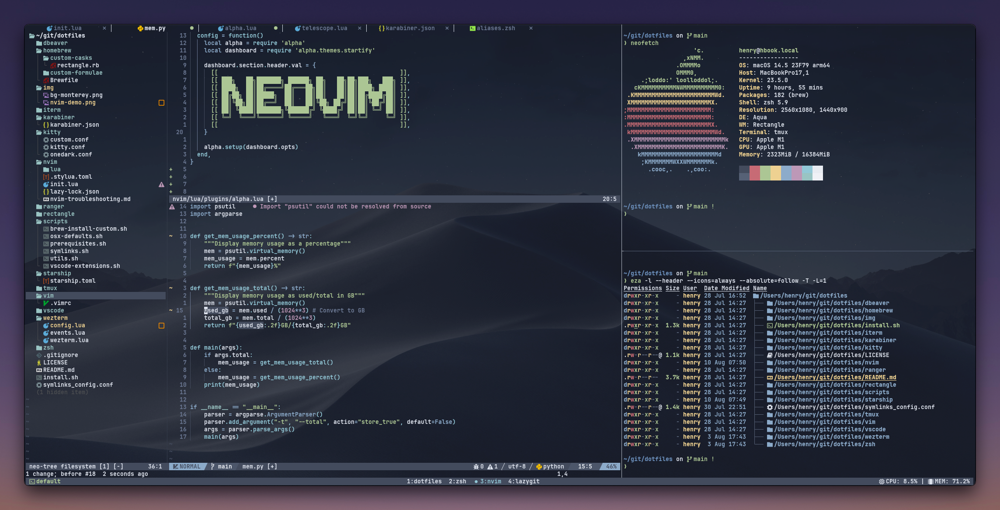

# Dotfiles

This repository contains my dotfiles, which are the config files and scripts I use to customize my development environment. These files help me maintain a consistent setup across different machines and save time when setting up new environments.



## Essential Tools

- **Editor**: [NeoVim](https://neovim.io/). As a fallback, I have a basic standard [Vim](https://www.vim.org/) config that provides 80% of the functionality of my NeoVim setup without any dependencies for maximum portability and stability.
- **Multiplexer**: [Tmux](https://github.com/tmux/tmux/wiki)
- **Main Terminal**: [WezTerm](https://wezfurlong.org/wezterm/index.html)
- **Shell Prompt**: [Starship](https://starship.rs/)
- **Color Theme**: All themes are based on the [Nord color palette](https://www.nordtheme.com/docs/colors-and-palettes). Themes can be easily switched via environment variables set in `.zshenv`.
- **Window Management**: [Rectangle](https://github.com/rxhanson/Rectangle) for resizing windows, paired with [Karabiner-Elements](https://karabiner-elements.pqrs.org/) for switching between applications.
- **File Manager**: [Ranger](https://github.com/ranger/ranger)

## Custom Window Management

I'm not a fan of the default window management solutions that macOS provides, like repeatedly pressing Cmd+Tab to switch apps or using the mouse to click and drag. To streamline my workflow, I created a custom window management solution using [Karabiner-Elements](https://karabiner-elements.pqrs.org/) and [Rectangle](https://rectangleapp.com/). By using these tools together, I can efficiently manage my windows and switch apps with minimal mental overhead and maximum speed, using only my keyboard. Here's how it works:

### Tab Key as Hyperkey

The `Tab` key acts as a regular `Tab` when tapped, but when held, it provides additional functionalities.

### Access Window Layer

Holding `Tab + W` enables a window management layer, where other keys become shortcuts to resize the current window using Rectangle.

**Examples:**

- `Tab + W + H`: Resize window to the left half
- `Tab + W + L`: Resize window to the right half

### Access Exposé Layer

Holding `Tab + E` enables an exposé layer, where other keys become shortcuts to open specific apps.

**Examples:**

- `Tab + E + J`: Open browser
- `Tab + E + K`: Open terminal

## Setup

To set up these dotfiles on your system, run:

```bash
./install.sh
```

Then follow the on-screen prompts.

## Uninstalling

If you ever want to remove the symlinks created by the installation script, you can use the provided symlinks removal script:

To delete all symlinks created by the installation script, run:

```bash
./scripts/symlinks.sh --delete
```

This will remove the symlinks but will not delete the actual configuration files, allowing you to easily revert to your previous configuration if needed.

## Adding New Dotfiles and Software

### Dotfiles

When adding new dotfiles to this repository, follow these steps:

1. Place your dotfile in the appropriate location within the repository.
2. Update the `symlinks_config.conf` file to include the symlink creation for your new dotfile.
3. If necessary, update the `install.sh` script to set up the software.

### Software Installation

Software is installed using Homebrew. To add a formula or cask, update the `homebrew/Brewfile` and run `./scripts/brew_install_custom.sh`. If you need to install a specific version of a package, find its Ruby script in the commit history of an official Homebrew GitHub repository and place it in the `homebrew/custom-casks/` or `homebrew/custom-formulae/` directory, depending on whether it's a cask or formula.
